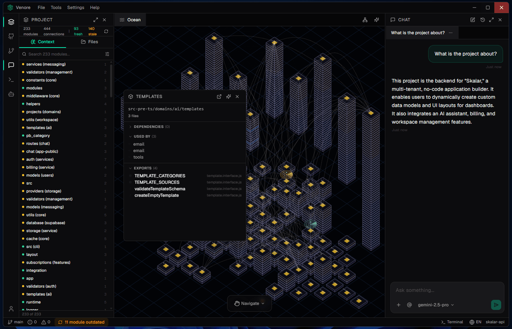

# Venore

> Visual context layer for codebases and knowledge work. A desktop app where you organize ideas, decisions, research, and code architecture on a 2D **Ocean Canvas**.

<p align="center">
  <a href="https://www.venore.app"></a>
  <a href="LICENSE"></a>
  <a href="https://github.com/edinsonjohender/venore/actions/workflows/ci.yml"></a>
</p>

<p align="center">
  
</p>

<p align="center"><sub>A codebase mapped on the Ocean Canvas — modules as towers, dependencies as links, with the AI agent in context.</sub></p>

---

## What it is

Venore is a desktop application built with **Tauri + Rust + React**, with two project modes:

- **Codebase** — a code project. The app analyzes structure, builds a compact **Project Memory** of the codebase, and gives the AI agent dev tools (file read/edit, terminal, search, web).
- **Knowledge** — a knowledge workspace. You organize topics as **islands** (clusters anchored by a **lighthouse**), with **knowledge nodes** as sub-topics, **sections** as markdown content, and **connections** as directed edges between nodes.

The AI agent uses BYOK (Bring Your Own Key) — Anthropic, OpenAI, Gemini, or local Ollama. API keys are stored in the OS keyring, never on plain disk.

---

## Stack

- **Backend:** Rust (Tokio · sqlx · Tauri 2)
- **Frontend:** React 18 · TypeScript · Vite · Zustand · shadcn (Radix UI)
- **3D:** React Three Fiber
- **Storage:** SQLite (config) + per-project JSON layouts
- **Code analysis:** tree-sitter (TS/JS/Python/Rust/Java/Go/C#/PHP/Ruby/Kotlin/C/C++/GDScript)

---

## Repository layout

```
crates/
├── venore-core/        # All business logic (shared library)
├── venore-desktop/     # Tauri app + React UI
├── venore-cli/         # CLI tools (wizard, eval harness)
└── venore-api/         # REST API server (optional)
```

**Principle:** all business logic lives in `venore-core`. The `venore-desktop` and `venore-api` crates are thin wrappers that expose that logic through Tauri commands or HTTP. The React UI holds no business logic — it receives data and emits intents.

---

## Prerequisites

- **Rust** stable — install via [rustup](https://rustup.rs)
- **Node.js v20+** and **pnpm** (`npm install -g pnpm`) — pnpm is required, do not use npm
- **Tauri platform deps:**
  - Windows: Visual Studio Build Tools
  - macOS: `xcode-select --install`
  - Linux: `libwebkit2gtk-4.1-dev build-essential libxdo-dev libssl-dev libayatana-appindicator3-dev librsvg2-dev`

---

## Getting started

```bash
# 1. Install frontend dependencies
cd crates/venore-desktop/ui
pnpm install
cd ../../..

# 2. (Optional) local environment variables
cp .env.example .env

# 3. Run the app in dev mode (front + back hot-reload)
cd crates/venore-desktop
cargo tauri dev --config tauri.dev.conf.json
```

> The `--config tauri.dev.conf.json` override runs the dev build under a
> separate identifier (`com.venore.app.dev`), so its WebView storage stays
> isolated from an installed release. The backend already splits its data
> directory by build profile (`%TEMP%/venore-dev` vs `~/.venore`), and API
> keys use a separate keyring namespace in debug builds.

### Tests

```bash
cargo test                  # Whole workspace
cargo test -p venore-core   # Single crate
```

### Production build

```bash
cd crates/venore-desktop
cargo tauri build
# Installable bundles in target/release/bundle/
```

---

## Contributing

Contributions are welcome. Read [CONTRIBUTING.md](CONTRIBUTING.md) before sending a PR.

Quick rules:
- Business logic only in `venore-core`. Tauri commands are wrappers.
- The React UI does not hold backend-derived state — it receives it.
- Reuse existing infrastructure (`VenoreError`, `tracing`, atomic writes, etc.) before inventing new patterns.
- No patches: fix the root cause, not the symptom.

For security issues, see [SECURITY.md](SECURITY.md). Do not open public issues for vulnerabilities.

---

## License

Venore is distributed under the **GNU Affero General Public License v3.0 or later** ([AGPL-3.0-or-later](LICENSE)).

In short: you may use, modify, and redistribute the software, including for commercial purposes — but if you distribute modified versions or run them as a network service, you must publish your modifications under the same license.
